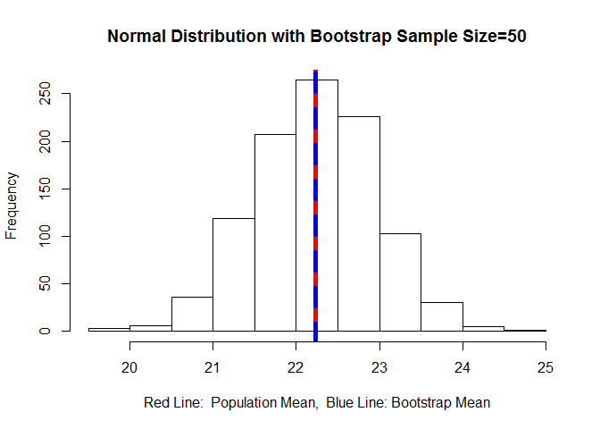
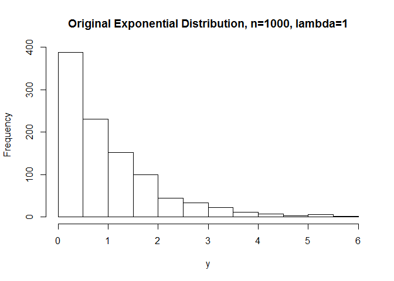
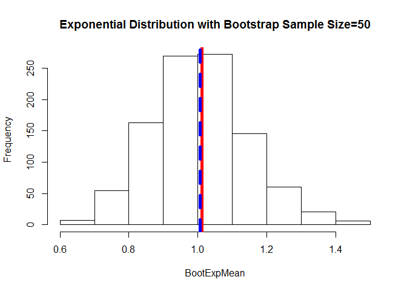

# MSDS 6306_Homework 04:  Central Limit Theorem and Bootstrap
Angela Horacek  
October 15, 2016  


```r
knitr::opts_chunk$set(echo = TRUE)
```

 
 
## Introduction
The Central Limit Theorem idea is that we can take a simple random sample 
of size (n=1000) from any population with mean(mu=22) and standard deviation(sd=5).  The sampling distribution(n greater than or equal to 25) is approximately normal with mean(mu) 
and will have a smaller deviation than the population. The bootstrap method will 
be used to recreate the sampling distribution of a statistic from the observed data.
The parameter values, the mean(mu) and standard deviation, will be considered from 
the first sample.  The sample statistics, bootstrap means and standard deviations, will be estimated using sample sizes of 50 and 200 iterated 1000 times each.

## Part I:  Illustrate Central Limit Theorem Using Bootstrap: Normal Distribution                                                               

Step 1A: Generate a random sample:  1000 observations, mean=22, std dev=5.
Create Histogram to show mean and spread.


```r
set.seed(12345)
x = rnorm(1000,22,5)
OrigMean <- 22
hist(x, main="Original Normal Distribution, n=1000, mean=22, sd=5")
```

<!-- -->


Step 2:  For the first sample, find the mean and standard deviation. These are considered the population parameters.


```r
xbar = mean(x)
xbar
```

```
## [1] 22.23099
```

```r
xsd <-sd(x)
xsd
```

```
## [1] 4.993738
```


Step 3:  Create the bootstrap sample statistics for the mean and standard deviation for sample size 50 and 200. 
a) Initialize the bootstrap vectors.
b) Create the For Loop for 1000 iterations
c) Find the bootstrap means and standard deviations for both sample sizes.


```r
BootNormMean <-numeric(1000)
BootNormMean2 <- numeric(1000)


for (i in 1:1000) {
    # Size Sample, size =50
    bootsamp <- sample(x,size=50, replace=TRUE)
    BootNormMean[i] <- mean(bootsamp)
    
    #Size Sample,size = 200
    bootsamp2 <- sample(x, size=200, replace=TRUE)
    BootNormMean2[i] <- mean(bootsamp2)
}

BootStrapMean <- mean(BootNormMean)
BootStrapMean
```

```
## [1] 22.23221
```

```r
BootStrapSd <- sd(BootNormMean)
BootStrapSd
```

```
## [1] 0.7166194
```

```r
BootStrapMean2 <- mean(BootNormMean2)
BootStrapMean2
```

```
## [1] 22.25447
```

```r
BootStrapSd2 <- sd(BootNormMean2)
BootStrapSd2
```

```
## [1] 0.3508029
```


Step 4A:  Compare the mean and standard deviations between the population and the bootstrap sample for the mean and standard deviation for sample size 50.   
a) Create the histograms for the normal distribution mean for sample size 50. The red line is the population sample mean and blue line is the bootstrap mean considered the estimate.


```r
hist(BootNormMean, main ="Normal Distribution with Bootstrap Sample Size=50", xlab = "Red Line:  Population Mean,  Blue Line: Bootstrap Mean")
abline(v=xbar, col="red", lwd=5, lty=1)
abline(v=BootStrapMean, col="blue", lwd=5, lty=2)
```

<!-- -->

b) Compare the mean and standard deviations between the population and estimate.  


```r
xbar
```

```
## [1] 22.23099
```

```r
BootStrapMean
```

```
## [1] 22.23221
```

```r
xsd
```

```
## [1] 4.993738
```

```r
BootStrapSd
```

```
## [1] 0.7166194
```


Step 4B:  Compare the mean and standard deviations between the population and bootstrap sample for the mean and standard deviation for sample size 200.
a) Create the histograms for the normal distribution mean for sample size 200. The red line is the population mean the and blue line is the bootstrap mean considered the estimate.


```r
hist(BootNormMean2, main="Normal Distribution with Bootstrap Sample Size=200")
abline(v=xbar, col="red", lwd=5, lty=1)
abline(v=BootStrapMean2, col="blue", lwd=5, lty=2)
```

<!-- -->


b) Compare the means and standard deviations.


```r
xbar
```

```
## [1] 22.23099
```

```r
BootStrapMean2
```

```
## [1] 22.25447
```

```r
xsd
```

```
## [1] 4.993738
```

```r
BootStrapSd2
```

```
## [1] 0.3508029
```

####Conclusion:  Normal Distribution
In both sample size 50 and 200 for 1000 samples, the bootstrap estimate means(22.23221 and 22.25447) are very near the population(first sample) mean of 22.23099.  The bootstrap standard deviations(0.7166194 and 0.3508029) are less than the population standard deviation(4.993738). As expected, the larger sample size(200) has a smaller standard deviation than the smaller sample size(50).  The results are consistent with the expected results.  


## Part II:  Illustrate Central Limit Theorem Using Bootstrap - Exponential Distribution 

Step 1: Generate a random sample of (observations = 1000, lambda=1)for an exponential distribution.


```r
set.seed(23456)
y <- rexp(1000)
hist(y, main="Original Exponential Distribution, n=1000, lambda=1")
```

<!-- -->

Step 2:  For the first sample, find the mean and standard deviation. These are considered the population parameters.


```r
xbarExp= mean(y)
xbarExp 
```

```
## [1] 1.012727
```

```r
ysdExp= sd(y)
ysdExp 
```

```
## [1] 0.9839453
```


Step 3:  Create the bootstrap sample statistics for the mean and standard deviation for sample size 50 and 200. 
a) Initialize the bootstrap vectors.
b) Create the For Loop for 1000 iterations.
c) Find the bootstrap means and standard deviations for both sample sizes. 


```r
BootExpMean <- numeric(1000)
BootExpMean2 <- numeric(1000)

for (i in 1:1000) {
    bootsamp3 <- sample(y, size=50, replace=TRUE)
    BootExpMean[i] <- mean(bootsamp3) 
    
    bootsamp4 <- sample(y, size=200, replace=TRUE)
    BootExpMean2[i] <- mean(bootsamp4)
}

MeanBootExp <- mean(BootExpMean)
MeanBootExp
```

```
## [1] 1.00697
```

```r
SdBootExp <- sd(BootExpMean)
SdBootExp
```

```
## [1] 0.1389593
```

```r
MeanBootExp2 <- mean(BootExpMean2)
MeanBootExp2
```

```
## [1] 1.013115
```

```r
SdBootExp2 <- sd(BootExpMean2)
SdBootExp2
```

```
## [1] 0.07099528
```


Step 4A:  Compare the mean and standard deviations between the population and the bootstrap sample for sample size 50. The red line is the population mean and blue line is the bootstrap mean considered the estimate.  
a) Create the histograms for the normal distribution mean for sample size 50.


```r
hist(BootExpMean, main= 'Exponential Distribution with Bootstrap Sample Size=50')
abline(v=xbarExp, col="red", lwd=5, lty=1)
abline(v=MeanBootExp, col="blue", lwd=5, lty=2)
```

<!-- -->


b) Compare the means and standard deviations.


```r
xbarExp 
```

```
## [1] 1.012727
```

```r
MeanBootExp
```

```
## [1] 1.00697
```

```r
ysdExp 
```

```
## [1] 0.9839453
```

```r
SdBootExp
```

```
## [1] 0.1389593
```


Step 4B:  Compare the mean and standard deviations between the population and the bootstrap sample for sample size 200. The red line is the population mean and the blue line is the bootstrap mean considered the estimate.  
a) Create the histograms for the exponential distribution mean for sample size 200. 
b) Compare the means and standard deviations. 


```r
hist(BootExpMean2, main="Exponential Distribution with Bootstrap Sample Size=200")
abline(v=xbarExp, col="red", lwd=5, lty=1)
abline(v=MeanBootExp2, col="blue", lwd=5, lty=2)
```

<!-- -->

b) Compare the means and standard deviations. 


```r
xbarExp 
```

```
## [1] 1.012727
```

```r
MeanBootExp2
```

```
## [1] 1.013115
```

```r
ysdExp 
```

```
## [1] 0.9839453
```

```r
SdBootExp2
```

```
## [1] 0.07099528
```

####Conclusion: Exponential Distribution
In both sample size 50 and 200 for 1000 samples, the bootstrap estimate means(MeanBootExp=22.23221 and MeanBootExp2=22.25447) are very near the population(first sample) mean(xbarExp =1.012727).  The bootstrap standard deviations(SdBootExp=0.7166194 and SdBootExp2= 0.3508029) are less than the population standard deviation(ysdExp=0.9839453). As expected, the larger sample size(200) has a smaller standard deviation than the smaller sample size(50).  The results are consistent with the expected results.  


 


